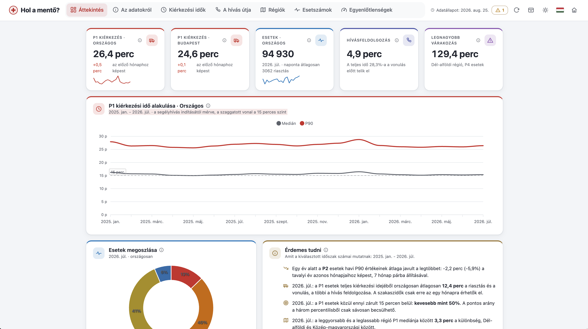

# Hol a mentő?

Független dashboard a magyarországi mentő-kiérkezési időkről, az Országos Mentőszolgálat statisztikái alapján: https://holamento.hu

Ez az oldal nem az Országos Mentőszolgálat hivatalos felülete. Az adatok forrása az OMSZ statisztikai oldala (https://stat.mentok.hu/), az oldal ugyanazokból a számokból
több nézetet és származtatott mutatót számol (év/év összevetés, szóródás, régiós
egyenlőtlenségek, normalizált esetszámok).

## Működés

Egyoldalas, statikus dashboard: vanilla JS + Vite + ApexCharts. A build egy kis HTML vázból,
egy CSS fájlból és két JavaScript csomagból áll: az alkalmazásból, illetve a diagramkönyvtárból,
amit az oldal csak akkor tölt be, amikor az első diagramra szükség van. Így az első festés nem
vár a diagramokra. Az app egyetlen JSON-t tölt be, a saját originjéről: `public/data.json`.

### Az archívum szerepe

Az app jelenleg nem olvassa az `archive/` mappát, és az nem is kerül a build kimenetébe
(nincs a `public/` alatt). A látogató mindig egyetlen fájlt tölt le, a legfrissebbet.

Az archívum passzív gyűjtés a jövőre: mivel a forrás csak "gördülő ablakot" ad (a hívás szakaszait csak a
legfrissebb hónapra, a régiós bontást csak az utóbbi hónapokra közli), ezért ami kiesik belőle,
azt később nem lehet visszakérni. A mentett archivumokból később összeállítható a
szakaszidők havi idősora és az előzetes-végleges revíziók története. Ha ez megvalósul, a
tervezett út egy build-időben előállított `public/history.json`, nem az archívum
kliensoldali betöltése.

### Vice code?

Igen, az oldal supervised AI-driven development eredménye.
